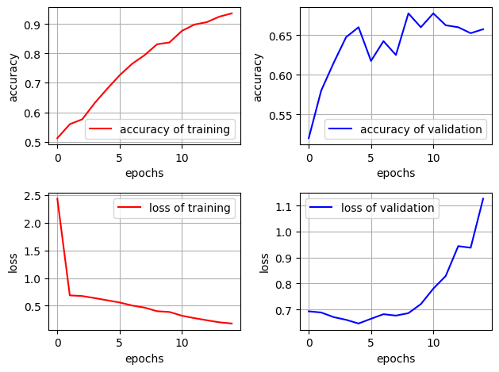
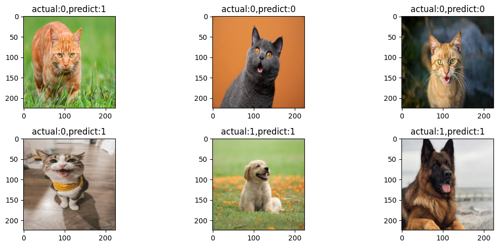

# Cat vs Dog Image Classifier Using CNN

This project demonstrates a Convolutional Neural Network (CNN) model to classify images as either **Cat (0)** or **Dog (1)** using a subset of the `Bingsu/Cat_and_Dog` dataset from Hugging Face. The model is trained from scratch and evaluated using both training metrics and visual testing on real images.

---

## 📁 Files Included

* `module.py`: Main training and evaluation script
* `fit_results.png`: Accuracy & loss curves for training and validation
* `module_test.png`: 6 sample predictions from the trained model

---

## 🌐 Dataset

* Source: Hugging Face (`Bingsu/Cat_and_Dog`)
* Format: Parquet files containing images in byte format and corresponding labels
* Sample used: 4000 images for training

---

## 🧠 Model Architecture

* `Conv2D(32, 3x3) + ReLU + MaxPooling2D`
* `Conv2D(64, 3x3) + ReLU + MaxPooling2D`
* `Conv2D(128, 3x3) + ReLU + MaxPooling2D`
* `Flatten`
* `Dense(64) + ReLU + Dropout(0.5)`
* `Dense(32) + ReLU + Dropout(0.5)`
* `Dense(1) + Sigmoid`  *(binary classification)*

Optimizer: **AdamW**
Loss: **Binary Crossentropy**
Metric: **Accuracy**

---

## 📊 Training Results

The model was trained for 15 epochs on 4000 images using an 90/10 train-validation split and batch size of 128.

* Training accuracy reached above 92%
* Validation accuracy plateaued around 66%
* Overfitting is visible from increasing validation loss

---

## 🔍 Evaluation Results on New Images

We evaluated 6 unseen images (3 cats, 3 dogs). Predictions were:

* **Cats misclassified as dogs** in 2 out of 3 cases
* **Dogs correctly classified** in all 3 cases

> The model is biased towards classifying dogs correctly, potentially due to data imbalance or features learned more distinctly from dogs.

---

## ❌ Limitations

* Slight overfitting: dropout used but may not be sufficient
* Model struggles with some cat images due to color/texture
* Performance can improve with data augmentation or pretrained features

---

## ✅ Future Improvements

* Use more data (full dataset or larger sample)
* Apply data augmentation (flip, rotate, zoom, etc.)
* Try transfer learning (e.g. MobileNet, VGG16)
* Use class balancing techniques if needed

---

## 🏰 Suggested Project Name

**SimpleCatDogCNN**
"A baseline CNN for cat vs dog classification using raw Hugging Face image data."

---

## ✍️ Author

Documented and implemented by \[saada].
